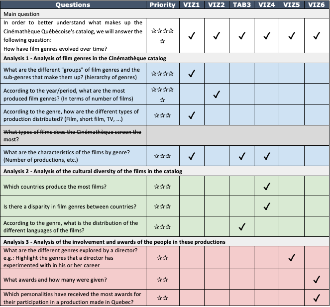

[>> Project site <<](https://inf8808-cinematheque-final.herokuapp.com/)

This project was realized in team and in collaboration with the Cinémathèque Québécoise.
                                         -----

**Goal of the project** : 
The main objective of this project was to use data from the Cinémathèqe Québécoise's catalog to produce a set of interactive visualizations. We chose was to trace the evolution of film genres over time. 

To do so, we developed a number of visualizations with a rendering thought as a "scrolly-telling" website where we go down in details. Through the use of interactive graphics, the user can explore the evolution of film genres in several aspects, according to the type of production (films, videos, TV) and personalities awarded. A visualization of film genres by regions/countries of the world has also been made, allowing for an analysis on the disparity of genres on a global scale. Thus, this tool highlights the dynamism of the production of cinematographic works over time.

Notes:
- The whole project was done with Python and Plotly.
- A lot of time was dedicated to prepare the data  ahead of the development because we had 6 datasets (200 000 rows on average) with many attributes and missing data. 
- We chose to limit the number of film genres to 12: Action, Animation, Adventure, Comedy, Crime, Documentary, Drama, Historical, Musical, Other, Romance, Science Fiction.

The visualizations are intended to answer the main question "How have film genres evolved over time?" and then a set of sub-questions detailed below.

                                         -----

**Preview of the visualizations**

For each visualizations, we discussed on the best graphic representation to choose taking into account the possibilities offered by Plotly.
The interactions (filter, hover, etc.) bring additional details of understanding.


*Full view on click*

                                         -----

[>> Project site <<](https://inf8808-cinematheque-final.herokuapp.com/)

Team - M.BHOGAL, F. TIRERA, G.LABERGE, J. DESMARAIS, P. DALLY-BELANGER, M. PEJU

Data source - Cinémathèque Québécoise

Tools - Python, Plotly, Github, Heroku

