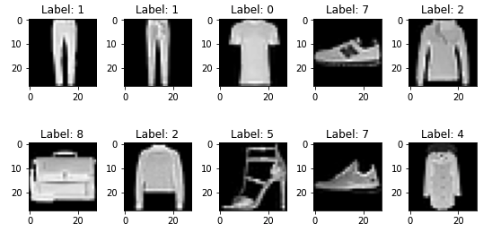
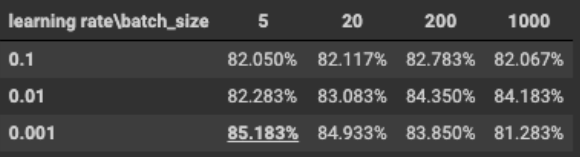
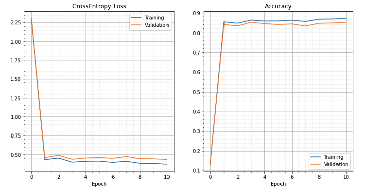
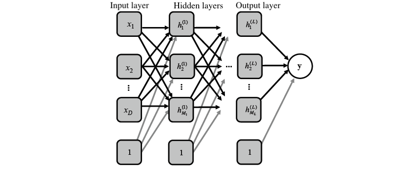
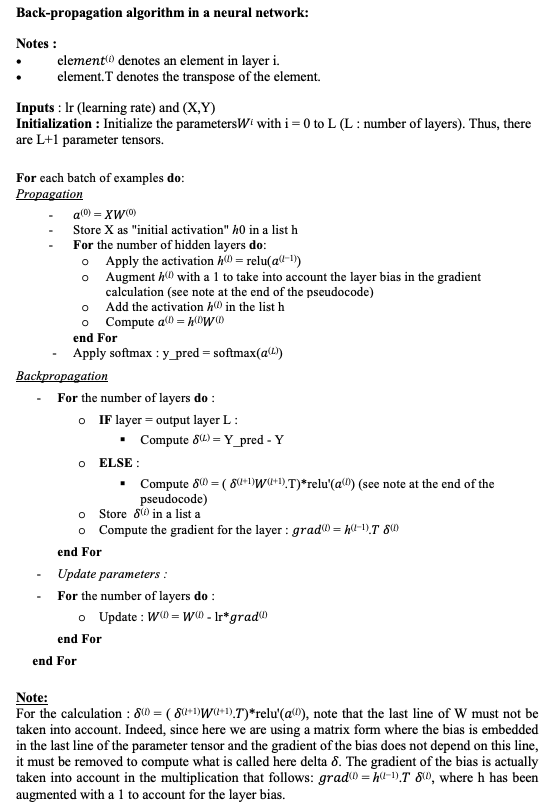
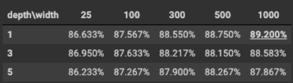
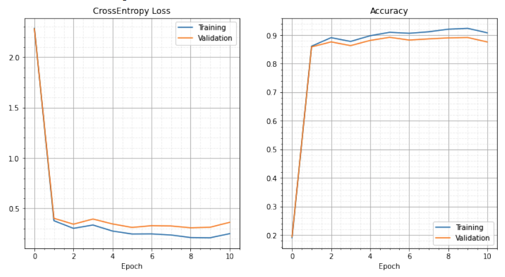

This project is part of my master’s degree program at Polytechnique Montreal in a course of artificial intelligence (probabilistic techniques).
                                         -----

**Goal of the project** : Classification of objects based on their photo.

To address this goal, I used the stochastic gradient descent algorithm (by mini-batch). It also involved to optimize the model hyper-parameters given a training data set, using a validation set to determine when to stop the optimization, and finally showing the performance on the test set.

                                         -----
**Data overview**

The dataset used is "Fashion MNIST" which contains 70,000 grayscale images divided into 10 categories. These are low-resolution (28 x 28 pixels) photos of clothing. The database was used as follows:
- 54 000 images for model training
- 6 000 images for validation
- 10 000 images for the test set

                                         -----
**Logistic regression and stochastic gradient descent by mini-batch**

The idea behind gradient descent is to minimize a loss function. The loss function evaluates the difference between the predictions made by the algorithm and the actual value. By trying to minimize it, it means that we try to make predictions that are as close as possible to the real values. In our case here, we will try to have the model predict the right class of object for a given photo that we will compare with the real class of the object.

Here's a video from StatQuest Youtube channel presenting the stochastic gradient descent technique:



There are different methods to update the model parameters. In this project, I used the classical stochastic gradient descent update which I compared to the ADAM [2] method which allows to speed up the gradient descent.

Functions of the model:
- Output function: Softmax
- Loss function : Negative log-likelihood

__Results' overview: ADAM__

Using the ADAM method for the update, I was able to obtain the following accuracy results depending on the batch size and the learning rate:

We can see that we obtain an accuracy between 81 and 85%. The best result (85% accuracy) is when we have a batch size of 5 and a learning rate equal to 0.001. Using this result to test the best model, we obtain the following curves:

We notice that our model learns well. Indeed, at epoch 0, the model performs the first propagation with the initial random parameters which explains the high loss and the accuracy of 13%. Then the model learns by updating the parameters using the ADAM method. The cross entropy decreases around 0.370 and the accuracy is then much better, with a maximum accuracy on the test set reached at epoch 10 with 85.183%.

                                         -----
**Second model : Multilayer Perceptron**

Let us now consider a neural network with an input layer with D = 784 pixels, L hidden layers, each with N neurons and an output vector y of dimension K = 10 classes. 

Functions of the model:
- Output function: Softmax
- Loss function : Multi-class cross-entropy
- Activation function(s) : ReLU

My demonstration for the calculation of the gradient is available on the [Project's Github](https://github.com/MorganPeju/Probabilistic_AI/tree/main/Classification_Logistic_Regression)

__Pseudo-code of the gradient backpropagation__

**Results' overview: ADAM**

Using ADAM to update the model weights, I was able to obtain the following accuracy results depending on the network depth and width:

We can see that we obtain an accuracy between 86 and 89% in all cases. The larger the network (number of neurons per layer), the better the accuracy. With 1 hidden layer and 1000 neurons per layer, we get the best result with an accuracy of 89.200%.
Using this result to test the best model, we obtain the following curves:

We notice that our model learns well. Indeed, at epoch 0, the model performs the first propagation with the initial random parameters which explains the high loss and the accuracy of 19%. Then the model learns by updating the parameters by the ADAM method and the cross entropy decreases below 0.5. The accuracy is then much better, with a maximum accuracy on the test set reached at epoch 5 with 89.2%.

**Conclusion**

Thus, this project allowed me to implement the stochastic gradient descent algorithm by mini-batch and to test different methods of updating parameters to improve the models. It is worth noting that by modifying the number of hidden layers and neurons, the accuracy increases until reaching ~87% . Finally, we have highlighted the performance of logistic regression and neural networks for a classification problem.

                                         -----

[>> Project's Github <<](https://github.com/MorganPeju/Probabilistic_AI/tree/main/Classification_Logistic_Regression)

Data Source - [FashionMNIST from Pytorch](https://pytorch.org/vision/main/generated/torchvision.datasets.FashionMNIST.html)

Tools - Python, Pytorch, Google Colab

[1] Photo by [Lum3n](https://www.pexels.com/fr-fr/@lum3n-44775?utm_content=attributionCopyText&utm_medium=referral&utm_source=pexels) from [Pexels](https://www.pexels.com/fr-fr/photo/vue-en-contre-plongee-des-chaussures-322207/?utm_content=attributionCopyText&utm_medium=referral&utm_source=pexels)

[2] ADAM: A METHOD FOR STOCHASTIC OPTIMIZATION, D. Kingma & J. Ba (2015), available online : https://arxiv.org/pdf/1412.6980.pdf
