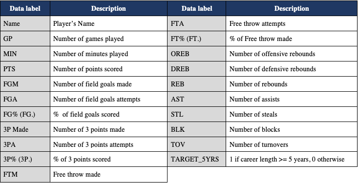
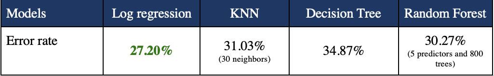
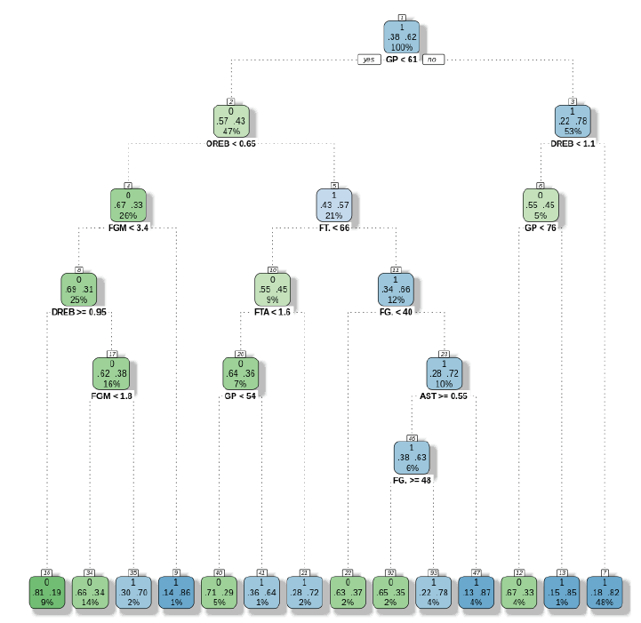

This project is part of my master's degree program at Polytechnique Montreal in a course on statistical learning methods. 
                                         -----

**Goal of the project** : Determine if a NBA rookie's career will be successful, i.e. last at least 5 years, using different statistical learning methods.

**Why ?** The National Basketball Association (NBA) is the best known basketball league in the world with 30 teams. NBA players are top athletes and are among the highest paid athletes in the world with an average salary of $7.7 million in 2020[1]. The NBA is the ultimate goal for any basketball player. Every year, in June, the Draft takes place. This is an event where all teams get together and select up to two players from college or abroad to join them. The selected players will then play their first season in the NBA, they are called Rookies. 

With only 60 new players per year, the number of candidates each year and the risk of being on a team but not playing, the career of an NBA player is more than uncertain at the beginning. It is also an issue for coaches and teams to develop and keep their team to the highest level. It is acknowledged that a rookie is considered to have successfully integrated into the NBA and promised to have a great career if he is still around 5 years after his draft.

                                         -----
**Data and models**

The dataset used has data from 1308 rookies (from the 1980s to 2016) and 19 game statistics (number of games played, minutes played, shots taken, shots scored, steals, etc.). These stats are the averages per game during their first season.

4 models were developed:
- Logistic regression with variable selection
- K nearest neighbors (KNN)
- Decision tree
- Random forest

Here is a summary of the results:

The logistic regression model performs slightly better than the other models. In general, all the models developed have an error rate of about 30%. This means that we are able to predict correctly in 70% of the cases if a rookie will have a career of at least 5 years in the NBA or not.

                                         -----
**Insight - Decision Tree**

The decision tree developed is a model that makes a prediction about a rookie's NBA career by creating a series of "If" statements. For example, a first division rule of the tree could be "If the rookie has played more than 61 games, then his career will last at least 5 years otherwise not." The next division could be, "If the player played more than 61 games and averaged 1.5 rebounds per game then his career will last at least 5 years otherwise not."
The decision tree produces a complex set of "if" statements that can be used to predict and does not produce a prediction formula like a regression model does.

The advantage of using a decision tree is that the results can be easily visualized and interpreted:

**_Example of interpretation:_**
*If a rookie played more than 61 games and averaged less than 1.1 defensive rebounds per game but played more than 76 games, then the probability of having a career of at least 5 years in the NBA is 95%.
On the other hand, if a rookie has played less than 61 games then he has a 47% probability of having a career of less than 5 years in the NBA.*

                                         -----

[>> Project's Github <<](https://github.com/MorganPeju/ml-nba-proj)

Data Source - [Data World](https://data.world/exercises/logistic-regression-exercise-1)

Tools - R, RStudio

*[1] [CNBC](https://www.cnbc.com/2019/10/22/highest-paid-players-in-the-nba-right-now.html)*

