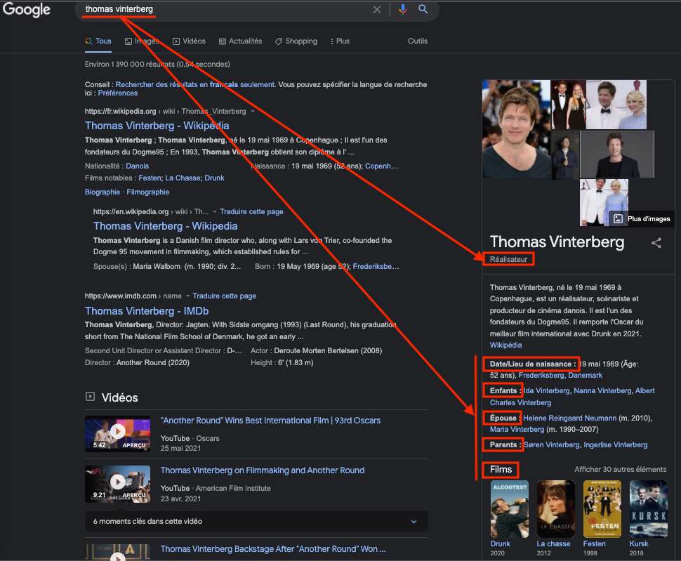
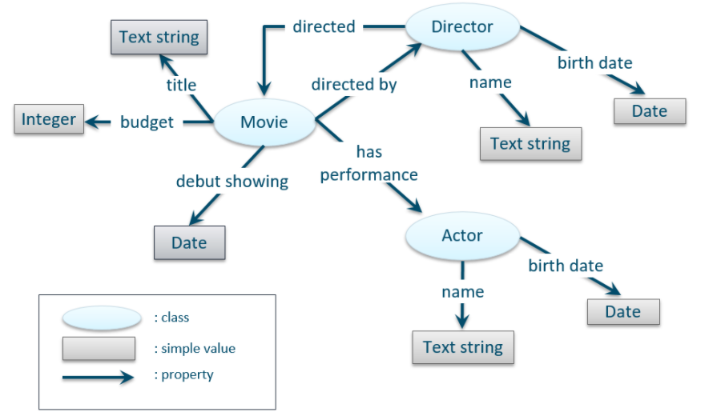
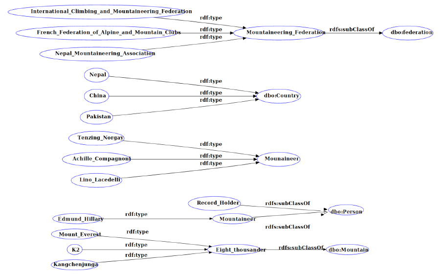

**Introduction to the Semantic Web**
-------

The semantic web had the ambition to improve the web so that machines can process the information that circulates on it, understand it and help us discover new knowledge. The initial purpose was to form a large distributed system to share data rather than documents and thus form knowledge bases. Since the Web is primarily a Web of documents (HTML files, etc.), the task of transforming each of these documents into data is a difficult one. However, this technology is not intended to replace the existing but rather to adopt an overlay approach, where we will virtualize the information already available and then link it between different connected systems.

The Semantic Web obviously echoes databases, but unlike them, research on the Semantic Web has focused more particularly on the integration of heterogeneous sources because it manages it well. Moreover, it can also be associated with NLP (Natural Language Processing). This tool allows for example to give answers to queries in natural language or the way around : to formulate queries from natural language. This is one of the reasons why the Semantic Web is very well associated with other fields such as Big Data and Artificial Intelligence.

Major computing companies have obviously taken part in the Semantic Web. Google, Microsoft, Yahoo and Yandex have joined forces to develop [Schema.org](https://schema.org/), a solution that aims to promote structured data in Web pages using a common vocabulary. Thus, search engines can provide richer information to users during their navigation thanks to this. 

Nevertheless, there are still some limiting problems with the Semantic Web, data quality for instance. This is directly linked to the integration of new, often unstructured data. This requires a lot of processing and even if machine learning can provide tools to facilitate the task, given the large variety of data sets, the integration of knowledge becomes quite difficult.
Moreover, information is not static, it evolves over time: it can be true at one moment, but become false in the future. This raises the question of the evolutivity of these knowledge bases and even more so their quality and exhaustiveness.

                                         -----

**Definition of an ontology**

One of the tools of the semantic web is the ontology. An ontology is a formal description of a knowledge domain. In other words, it is a list of terms and relationships between these terms. The defined terms are also called "classes". The OWL language allows to model an ontology by respecting a descriptive logic [1].

Here is a minimal example of an ontology :

We describe here that a film has a title, a budget, a date, a director. This director has a name, a date of birth, etc.

The main interest then is that we can query this knowledge base using queries (SPARQL for example). For example, we can query our knowledge base to obtain the list of films produced between the 80s and 90s. 

                                         -----

**Project**

This project is part of my master's degree program at Polytechnique Montreal in a course on semantic web. 

-----

To put this into practice, I have developed an ontology about mountaineering by applying an iterative method [3].  
The goal of this ontology is to gather and link information about peaks over 8000 meters and their ascents. The ontology is thus composed of a certain number of classes such as those of eight-thousanders, climbers, mountaineering federations, ascents, mountaineering records, etc.

The iterative method used, SAMOD, involves building the ontology step by step through scenarios. At the end of the development of a scenario, tests (queries) are performed before merging with the complete ontology. Then non-regression tests are also performed: we check that the queries of all the previous scenarios give correct answers. 

Furthermore, the ontology must be developed in a consistent manner, i.e. for each concept, there can exist at least one individual member of that class. For example, if we define the concept of climber as being both a subclass of the classes PERSON and OBJECT and we also specify that these two classes are disjoint (i.e. no entity can be both a PERSON and an OBJECT), we end up with an inconsistent concept.

Overview of the ontology and a development scenario :

*Full view on click*

                                         -----

Tools - Protege, OWL, Turtle

[1] [Descriptive logic](https://en.wikipedia.org/wiki/Description_logic)    
[2] Image from [Cambridge Semantics](https://docs.cambridgesemantics.com/anzo/v4.3/userdoc/models-intro.htm) documentation             
[3] Iterative methodology : [SAMOD](https://essepuntato.it/samod/)  

