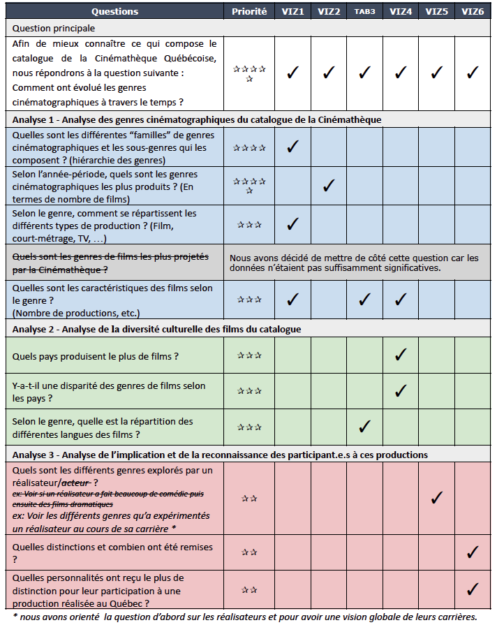

[>> Site du projet <<](https://inf8808-cinematheque-final.herokuapp.com/)

Ce projet a été réalisé en équipe et en collaboration avec la Cinémathèque Québécoise.

                                         -----

**Objectif du projet**
L'objectif principal de ce projet a été d'utiliser les données du catalogue d'œuvres de la Cinémathèque Québécoise pour produire un ensemble de visualisations interactives. L'axe d'analyse que nous avons choisi a été de retracer l’évolution des genres cinématographiques à travers le temps. 

Pour cela, nous avons développé un certain nombre de visualisations avec un rendu pensé comme un site web “scrolly-telling” où on descend en granularité d'informations. C’est par l’utilisation de graphiques interactifs que l’utilisateur peut explorer l’évolution des genres du cinéma sous plusieurs aspects, notamment selon les types de production (films, vidéos, TV) et les personnalités du Cinéma récompensées. Une visualisation des genres cinématographiques par régions/pays du monde a également été effectuée, permettant ainsi de mener une réflexion sur la disparité des genres à l’échelle mondiale. Ainsi, cet outil permet en évidence le dynamisme de la production d'œuvres cinématographiques à travers le temps.

Notes:
- L'ensemble du projet a été réalisé avec Python et Plotly.
- Un grand travail a été effectué en amont du développement pour préparer les données car nous disposions de 6 jeux de données (200 000 lignes en moyenne) avec de nombreux attributs et données manquantes. 
- Nous avons fait le choix de limiter le nombre de genres cinématographiques à 12 : Action, Animation, Amour, Aventure, Autres, Comédie, Crime, Documentaire, Drame, Historique, Musical, Science-Fiction.

Les visualisations ont pour but de répondre à la question principale “Comment ont évolué les genres cinématographiques à travers le temps ?” puis à un ensemble de sous-questions détaillées ci-dessous.

                                         -----

**Extrait des visualisations**

Chacune des visualisations a fait l'objet de réflexions sur la meilleure représentation graphique à adopter, tout en tenant compte des possibilités offertes par Plotly.
Les interactions possibles (filtre, hover, etc.) apportent des éléments des détails de compréhension supplémentaires.


*Cliquez pour agrandir*

                                         -----

[>> Site du projet <<](https://inf8808-cinematheque-final.herokuapp.com/)

Equipe - M.BHOGAL, F. TIRERA, G.LABERGE, J. DESMARAIS, P. DALLY-BELANGER, M. PEJU

Source des données - Cinémathèque Québécoise

Outils - Python, Plotly, Github, Heroku

