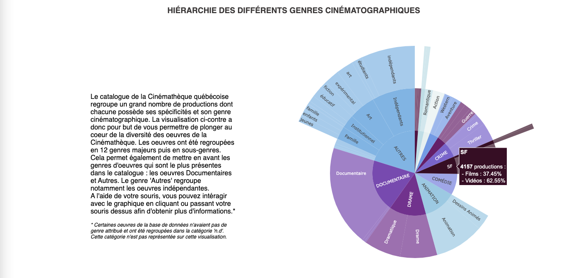

[>> Site du projet <<](https://inf8808-cinematheque-final.herokuapp.com/)

Au fil de l’histoire, le cinéma s’est affirmé parmi les arts du spectacle et occupe aujourd’hui une place prépondérante dans la culture. Considérées comme mémoire culturelle, les oeuvres cinématographiques présentent des caractéristiques et métriques complexes qui sont
compliquées à suivre au cours du temps. En général, on distingue plusieurs catégories :
action, comédie, drame, fantastique, science-fiction, guerre, etc. Le genre cinématographique n’est pas exclusif et il est ardu de limiter un film à un unique genre. 

                                         -----

**Objectif du projet - Retracer l’évolution des genres cinématographiques au cours du temps**

En équipe et en collaboration avec la Cinémathèque Québécoise nous avons souhaité mettre en avant le contenu de son catalogue à travers différentes visualisations. A travers ce projet nous pensons avoir contribué à apporter des clés d’analyse et de compréhension. 

Pour cela, nous avons développé un certain nombre de visualisations pour répondre à notre problématique. Le rendu a été pensé comme un site web "scrolly-telling". C’est par l’utilisation de graphiques interactifs que l’utilisateur peut explorer l’évolution des genres du cinéma sous plusieurs aspects, notamment selon les types de production (film, court métrage, TV, etc.) et les réalisateur.ice.s/acteur.ice.s récompensé.e.s . Une visualisation des genres cinématographiques selon la localisation géographique a également été effectuée, permettant ainsi de mener une investigation sur la disparité des genres à l’échelle mondiale. Ainsi, cet outil permet en évidence le dynamisme des oeuvres cinématographiques à travers le temps. 

Les viz doivent répondre à la question principale "Comment ont évolué les genres cinématographiques à travers le temps ?" puis à un ensemble de sous-questions. Celles-ci sont détaillées ci-dessous.

                                         -----

**Choix des visualisations**



[>> Site du projet <<](https://inf8808-cinematheque-final.herokuapp.com/)

*Sources des données - Cinémathèque Québécoise*

*Outils - Python, Plotly, Github, Heroku*

