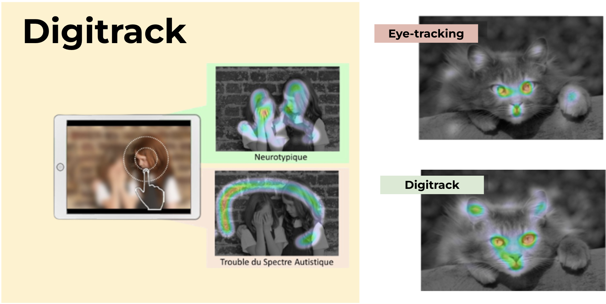
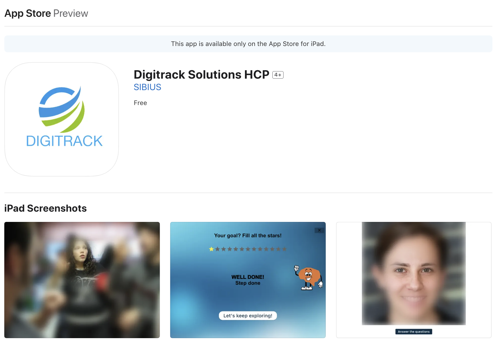

                                         -----
**La start-up SIBIUS**

Fondée en 2019 à partir de travaux issus de l’Institut des Sciences Cognitives Marc Jeannerod du CNRS, SIBIUS développait une application dans le domaine de la santé pour la détection précoce et l’amélioration de la prise en charge des troubles cognitifs tels que l’autisme, Alzheimer, troubles de l’attention. En s’appuyant sur la technologie brevetée du Digitrack, SIBIUS avait pour ambition de créer le premier marqueur objectif des troubles du neurodéveloppement grâce à une solution simple et non invasive.

Les données collectées par SIBIUS en partenariat avec le CNRS permettent l’élaboration d’algorithmes et de modèles d’apprentissage machine afin de distinguer les explorations d’un sujet neurotypique d’un sujet neuroatypique. La base de données contient plus de 40 000 explorations d'images effectuées par plus de 1 300 sujets neurotypiques ou neuroatypiques.

Labellisée « Deep Tech » par BPIFrance, organisme français de financement et de développement des entreprises, SIBIUS a plusieurs fois été récompensée, notamment par le prix « Start-up » au Congrès français de psychiatrie en décembre 2019, ainsi que par le prix du jury lors de la Journée « start-up innovantes » organisée en 2021 par le Syndicat National de l'Industrie des Technologies Médicales (SNITEM).

                                         -----
**Méthode Digitrack**

La détection des troubles cognitifs fait l’objet de nombreuses publications scientifiques. L’une des méthodes régulièrement employées dans un cadre de recherche est l’eye-tracking. L’eye-tracking, ou oculométrie, désigne l'enregistrement et l'étude des mouvements oculaires lors de l’observation d’objets en mouvement, de la lecture ou en réponse à des stimuli visuels. Néanmoins, cette technologie est non seulement coûteuse mais aussi difficile à mettre en place à grande échelle car elle nécessite que de nombreuses conditions d’expérimentation soient remplies, comme par exemple la calibration de l’appareil d’oculométrie pour chaque sujet. C’est pourquoi une équipe de chercheurs de l’Institut des Sciences Cognitives Marc Jeannerod (CNRS et Université de Lyon 1) a développé un dispositif plus simple, moins coûteux et qui peut être distribué à grande échelle : le Digitrack. Cette technologie a fait l’objet de la publication « Digit-tracking as a new tactile interface for visual perception analysis »3 par Lio et al dans Nature Communications en 2019 [1]. Cette étude a permis de mettre en lumière la corrélation entre le suivi oculaire par Eye-Tracking et le suivi grâce au Digitrack.

Digitrack consiste à présenter sur une interface tactile (une tablette), une image floue qui se défloutera localement au passage d’un doigt sur l’écran. L'image floue permet de simuler la vision périphérique. La vision dite « centrale » est simulée lorsque le doigt touche en un point l’écran en révélant l'image. L’étude a mis en évidence que le mouvement des doigts pour explorer une image revient à approximer les mouvements oculaires. Grâce au Digitrack, parcourir une image avec son doigt génère une carte de chaleur (densité des points explorés sur une image). Les résultats ont montré qu’il y avait une corrélation entre les cartes de chaleur obtenues par eye-tracking et celles obtenues par Digitrack.

À partir de l’analyse des données enregistrées à partir des explorations effectuées via la méthode Digitrack et en renforçant le traitement par l’usage de l’intelligence artificielle, les explorations effectuées par un sujet peuvent être comparées à celles d’une population neurotypique afin de déceler un comportement jugé atypique témoignant d’un potentiel trouble cognitif.

**Plateforme technologique**

Responsable de la plateforme technologique de SIBIUS, j'ai travaillé pendant 1,5 an tant sur le segment traitement de données et développement d'algorithmes d'apprentissage machine pour la détection de comportements neuroatypiques que sur le développement web et mobile de la solution.
Les données collectées au travers des tests cognitifs Digitrack réalisés sur l'application mobile (iOS et Android) permettaient le calcul en temps réel des résultats des tests grâce au back-end développé sur le cloud AWS (S3, RDS, Lambda, API Gateway) et l'alimentation en temps réel de la plateforme web de suivi (Django).

                                         -----
L'entreprise SIBIUS a malheureusement été liquidée fin 2023.

Outils - Git, AWS, Flutter, Python, PostgreSQL

*[1] [Nature Communications - Digit-tracking as a new tactile interface for visual perception analysis](https://doi.org/10.1038/s41467-019-13285-0)*
