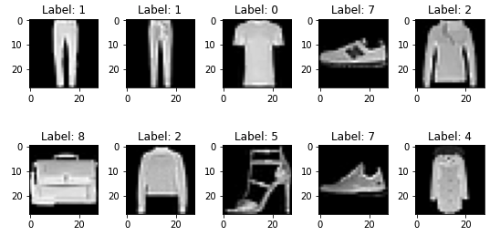
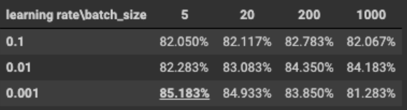
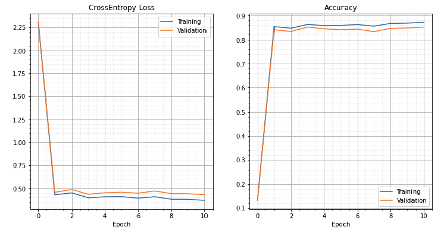
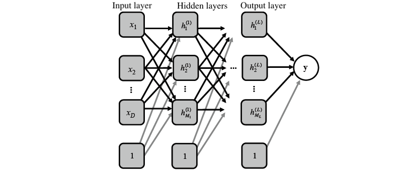
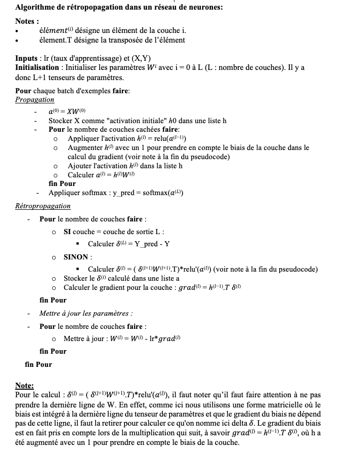
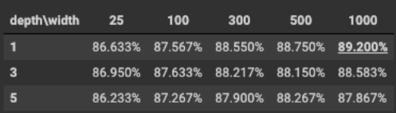
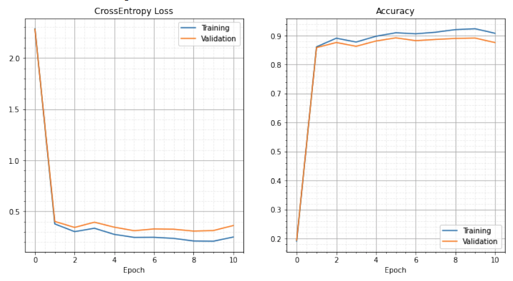

Ce projet s'inscrit dans mon parcours de maîtrise à Polytechnique Montréal dans le cadre d'un cours d'intelligence articielle (techniques probabilistes). 
                                         -----

**Objectif du projet** : Classification d'objets à partir de leur photo.

Pour répondre à cet objectif, j'ai utilisé l’algorithme de descente de gradient stochastique par mini-ensemble. Il a également été question d'optimiser les hyper-paramètres des modèle étant donné un ensemble de données d’apprentissage, en utilisant un ensemble de validation pour déterminer quand arrêter l'optimisation, et finalement de montrer la performance sur l’ensemble du test.

                                         -----
**Aperçu des données**

L'ensemble de données utilisé est "Fashion MNIST" qui contient 70 000 images en niveaux de gris réparties en 10 catégories. Il s'agit de photos de vêtements en basse résolution (28 x 28 pixels). La base de données a été utilisée comme suit:
- 54 000 images pour l'entrainement des modèles
- 6 000 images pour la validation
- 10 000 images pour l'ensemble de test

                                         -----
**Régression logistique et algorithme de descente de gradient stochastique par mini-ensemble**

L'idée derrière la descente de gradient est de minimiser une fonction de perte. La fonction de perte évalue la différence entre les prédictions faites par l'algorithme et la valeur réelle. En cherchant à la minimiser, cela signifie que nous essayons de faire des prédictions qui soient les plus proches des valeurs réelles. Dans notre cas d'application ici, on cherchera à ce que le modèle prédise la bonne classe d'objet pour une photo donnée que l'on comparera avec la vraie classe de l'objet.

Voici une vidéo de la chaine StatQuest présentant la technique de descente de gradient stochastique:



Il existe différentes méthodes pour effectuer l'actualisation des paramètres du modèle. Dans ce projet, j'ai utilisé l'actualisation classique de la descente de gradient stochastique que j'ai comparé à la méthode d'actualisation ADAM [2] qui permet d'accélérer la descente de gradient. 

Fonctions du modèle:
- Fonction de sortie  : Softmax
- Fonction de perte : Log-vraisemblance négative

__Aperçu des résultats: ADAM__

En utilisant la méthode ADAM pour l’actualisation, j’ai pu obtenir les résultats de précisions suivants en fonction de la taille du batch et du taux d’apprentissage :

On peut voir qu’on obtient une précision entre 81 et 85% dans tous les cas. Le meilleur résultat (taux de précision de 85%) est lorsqu'on a une taille de batch de 5 et taux d’apprentissage égale à 0.001. En utilisant ce résultat pour tester le meilleur modèle, on obtient les courbes suivantes :

On remarque que notre modèle apprend bien. En effet, à l’epoch 0, le modèle effectue la première propagation avec les paramètres aléatoires initiaux ce qui explique la perte élevée et la précision de 13%. Puis le modèle apprend en actualisant les paramètres par la méthode ADAM. L’entropie croisée diminue autour de 0.370 et la précision est alors bien meilleure, avec une précision maximale de validation atteinte à l’epoch 10 avec 85.183%.

                                         -----
**Deuxième modèle : Perceptron multicouche**

Considérons maintenant un réseau de neurones avec une couche d’entrée avec D = 784 unités, L couches cachées, chacune avec N neurones et un vecteur de sortie y de dimension K=10 classes. 

Fonctions du modèle:
- Fonction de sortie  : Softmax
- Fonction de perte : Entropie croisée multiclasse
- Fonction(s) d'activation(s) : ReLU

Ma démonstration pour le calcul du gradient est disponible sur le [Github du projet](https://github.com/MorganPeju/Probabilistic_AI/tree/main/Classification_Logistic_Regression)

__Pseudo-code de la rétropropagation du gradient__

###*Aperçu des résultats : ADAM*

En utilisant ADAM pour l’actualisation des poids du modèle, j’ai pu obtenir les résultats de précision suivants en fonction de la profondeur et largeur du réseau de neurones :

On peut voir qu’on obtient une précision entre 86 et 89% dans tous les cas. On remarque une nouvelle fois que plus le réseau est large (nombre de neurones par couche), meilleure est la précision. Avec 1 couche cachée et 1000 neurones par couches, on obtient le meilleur résultat avec une précision de 89.200%.
En utilisant ce résultat pour tester le meilleur modèle, on obtient les courbes suivantes :

On remarque que notre modèle apprend bien. En effet, à l’epoch 0, le modèle effectue la première propagation avec les paramètres aléatoires initiaux ce qui explique la perte élevée et la précision de 19%. Puis la modèle apprend en actualisant les paramètres par la méthode ADAM et l’entropie croisée diminue sous 0.5. La précision est alors bien meilleure, avec une précision maximale de validation atteinte à l’epoch 5 avec 89.2%.

**Conclusion**

Ainsi, ce projet m'a permis de mettre en place l'algorithme de descente de gradient stochastique par mini-ensemble et de tester différentes méthodes d'actualisation de paramètres pour améliorer les modèles. Avec la méthode Adam, on obtient des résultats (en terme de précision) meilleurs qu’avec la méthode classique SGD (résultats disponible sur le [Github du projet](https://github.com/MorganPeju/Probabilistic_AI/tree/main/Classification_Logistic_Regression)). De plus, on notera qu’en jouant sur le nombre de couches cachées et de neurones, la précision augmente jusqu'à atteindre ~87% . Finalement, on aura mis en évidence le performance de la régression logistique et des réseaux de neurones pour un problème de classification.

                                         -----

[>> Github du projet <<](https://github.com/MorganPeju/Probabilistic_AI/tree/main/Classification_Logistic_Regression)

Source des données - [FashionMNIST de Pytorch](https://pytorch.org/vision/main/generated/torchvision.datasets.FashionMNIST.html)

Outils - Python, Pytorch, Google Colab

[1] Photo de [Lum3n](https://www.pexels.com/fr-fr/@lum3n-44775?utm_content=attributionCopyText&utm_medium=referral&utm_source=pexels) provenant de [Pexels](https://www.pexels.com/fr-fr/photo/vue-en-contre-plongee-des-chaussures-322207/?utm_content=attributionCopyText&utm_medium=referral&utm_source=pexels)

[2] ADAM: A METHOD FOR STOCHASTIC OPTIMIZATION, D. Kingma & J. Ba (2015), disponible en ligne : https://arxiv.org/pdf/1412.6980.pdf
