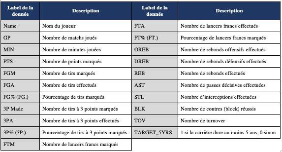
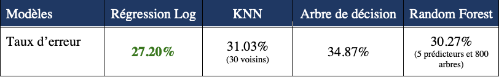
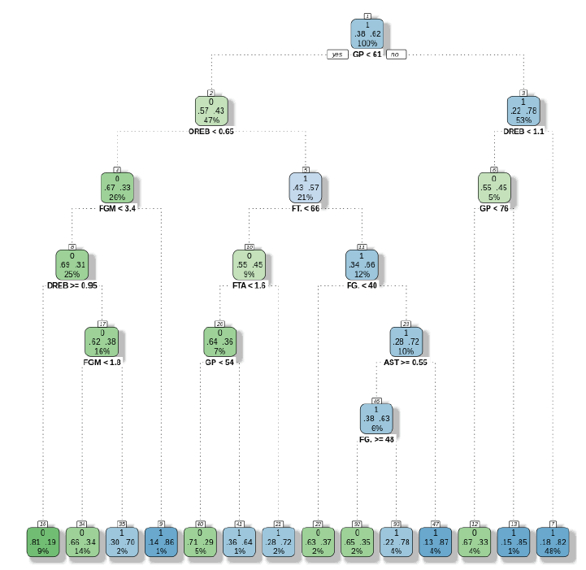

Ce projet s'inscrit dans mon parcours de maîtrise à Polytechnique Montréal dans le cadre d'un cours de méthodes statistiques d'apprentissage. 
                                         -----

**Objectif du projet** : Déterminer si la carrière d’un rookie sera une réussite, i.e que sa carrière durera au moins 5 ans, à l'aide de différentes méthodes statistiques d'apprentissage.

**Pourquoi ?** La National Basketball Association (NBA) est la plus connue des ligues de basket-ball au monde qui compte 30 équipes. Les joueurs de NBA sont des athlètes de très haut niveau et font partie des sportifs les mieux payés au monde avec un salaire moyen de $7.7 millions de dollars en 2020[1]. La NBA représente ainsi l’objectif ultime de tout joueur de basket. Chaque année, au mois de juin, a lieu la Draft. Il s’agit d’un événement où toutes les équipes se réunissent et choisissent jusqu’à deux joueurs issus de l’université ou de l’étranger pour rejoindre leur rang. Les joueurs sélectionnés disputeront alors leur première saison en NBA, on les nomme les Rookies. 

Avec seulement 60 nouveaux joueurs par an, de nombreux candidats chaque année et le risque de faire partie d’une équipe mais de ne pas jouer, la carrière d’un joueur de NBA est plus qu’incertaine à ses débuts. Il s’agit également d’un enjeu pour les coachs et les équipes afin de pérenniser leur équipe et de la faire évoluer au plus haut niveau. Il est admis que l'on considère qu’un rookie a réussi son intégration en NBA et promis à une belle carrière si celui-ci est encore présent 5 ans après son draft.

                                         -----
**Données et modèles**

Le dataset utilisé compte les données de 1308 rookies (des années 1980 à 2016) et 19
statistiques de matchs (nombre de matchs joués, minutes jouées, tirs effectués, tirs marqués, interceptions, etc.). Ces statistiques sont les moyennes par match pendant leur première saison.

4 modèles ont été développés :
- Régression logistique avec sélection de variables
- K plus proches voisins (KNN)
- Arbre de décision
- Forêts aléatoires (Random Forest)

Voici une synthèse des résultats:

Le modèle de régression logistique offre une performance légèrement meilleure que les autres modèles. De manière générale, l’ensemble des modèles développés ont un taux d’erreur d’environ 30%. Cela signifie qu’on est capable de prédire correctement dans 70% des cas si un rookie aura une carrière d’au moins 5ans ou non en NBA.

                                         -----
**Extrait - Arbre de décision**

L'arbre de décision développé est un modèle qui effectue une prédiction sur la carrière d’un rookie en NBA en créant une série d'instructions "Si". Par exemple, une première règle de division de l’arbre pourrait être la suivante : “Si le rookie a joué plus de 61 matchs, alors sa carrière durera au moins 5 ans sinon non.” La division suivante pourrait être : "Si le joueur a joué plus de 61 matchs et qu’il a effectué 1.5 rebonds par match en moyenne alors sa carrière durera au moins 5 ans sinon non”.
L’arbre de décision produit une série complexe d'instructions “si” qui peuvent être utilisées pour prédire et ne produit pas de formule de prédiction comme le fait un modèle de régression.

L’avantage d’utiliser un arbre de décision est qu’on peut visualiser et interpréter facilement les résultats:

**_Exemple d’interprétation :_**
*Si un rookie a joué plus de 61 match et qu’il a effectué moins de 1.1 rebond défensif en moyenne par match mais qu’il a joué plus de 76 matchs, alors la probabilité d’avoir une carrière d’au moins 5 ans en NBA est de 95%.
En revanche, si un rookie a joué moins de 61 matchs alors il a une probabilité de 47% d’avoir une carrière de moins de 5 ans en NBA.*

                                         -----

[>> Github du projet <<](https://github.com/MorganPeju/ml-nba-proj)

Source des données - [Data World](https://data.world/exercises/logistic-regression-exercise-1)

Outils - R, RStudio

*[1] [CNBC](https://www.cnbc.com/2019/10/22/highest-paid-players-in-the-nba-right-now.html)*

