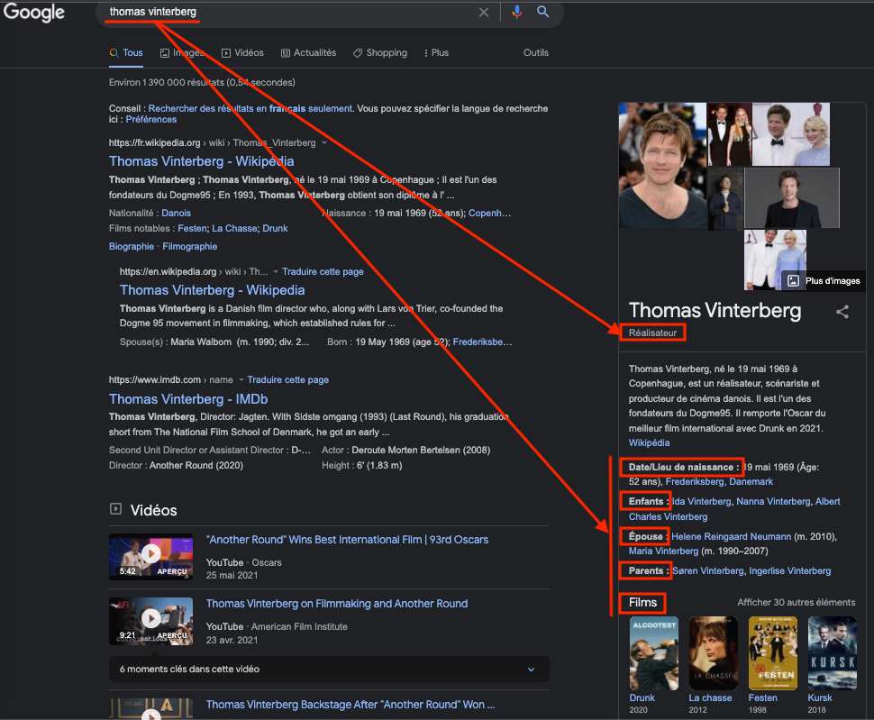
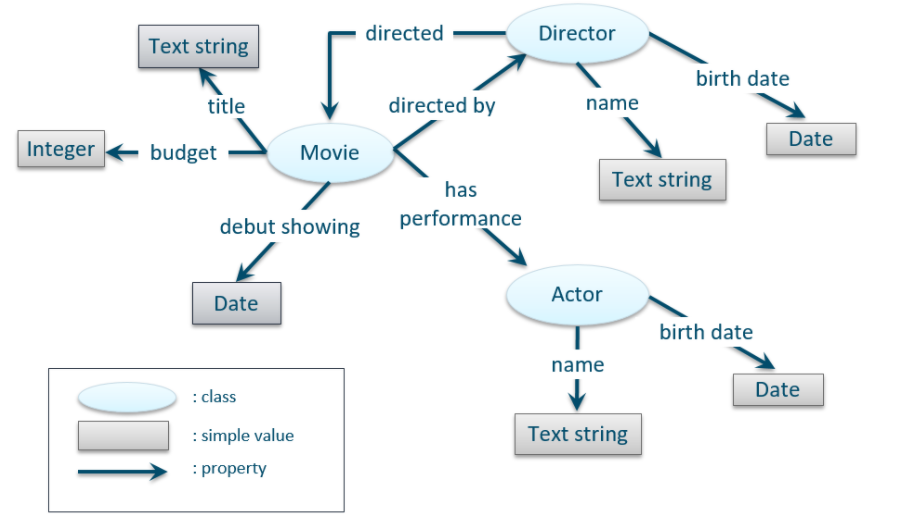
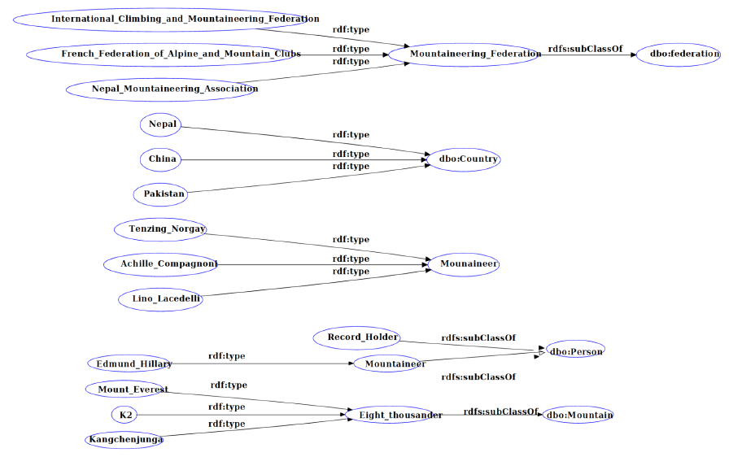

**Préambule sur le Web Sémantique**
-------

Le web sémantique avait pour ambition d’améliorer le web actuel afin que les machines puissent traiter les informations qui y circulent, les comprendre et nous aider à découvrir de nouvelles connaissances. La proposition initiale était de former un grand système distribué pour partager des données plutôt que des documents et ainsi former des bases de connaissances. Puisque le Web est d’abord un Web de documents (fichiers HTML, etc.), la tâche s’avère ardue de transformer chacun de ces documents en données. Toutefois, cette technologie n’a pas pour vocation de remplacer l’existant mais plutôt d’adopter une approche de superposition, où l’on va venir virtualiser les informations déjà disponibles puis les relier entre différents systèmes connectés.

Bien évidemment, le Web sémantique fait écho aux bases de données mais contrairement à elles, la recherche sur le Web sémantique s’est plus particulièrement axée sur l'intégration de sources hétérogènes car celui gère bien la grande variété des données. D’autre part, on peut également l’associer au NLP (*Natural Language Processing* ou le traitement de langage naturel). Cet outil permet par exemple de donner des réponses aux requêtes en langage naturel ou inversement: formuler des requêtes à partir du langage naturel. C’est notamment en cela que le Web Sémantique s’associe très bien avec d’autres domaines comme le Big Data et l’Intelligence Artificielle.

Les géants du Web et de la Tech ont bien évidemment pris part dans le Web sémantique. Google, Microsoft, Yahoo et Yandex ont mutualisé leurs efforts pour développer [Schema.org](https://schema.org/), une solution qui vise à promouvoir les données structurées dans les pages Web à l'aide un vocabulaire commun. Ainsi, les moteurs de recherche peuvent fournir des informations plus riches aux utilisateurs lors de leur navigation grâce à ces données. 

Néanmoins, il reste tout de même certains problèmes limitant au Web Sémantique comme par exemple la qualité des données. Ceci est directement lié à l’intégration de nouvelles données, souvent non structurés. Cela nécessite beaucoup de traitement et même si le machine learning peut apporter des outils pour faciliter la tâche, compte tenu de la grande variété d'ensembles de données, l'intégration des connaissances devient assez difficile.
De plus, une information n'est pas statique, elle évolue dans le temps : elle peut être vraie à un instant, mais devenir fausse dans le futur. Cela pose alors la question de l’évolutivité de ces bases de connaissances et a fortiori de leur qualité et exhaustivité.

                                         -----

**Définition d'une ontologie**

L'un des outils du web sémantique est l'ontologie. Une ontologie est une description formelle d'un domaine de connaissances. Autrement dit, il s'agit d'une liste de termes et de relations entre ces termes. Les termes définis sont également appelés "classes". Le langage OWL permet de modéliser une ontologie en respectant une logique descriptive [1].

Voici un exemple minimal d'une ontologie :

On décrit ici qu'un film possède un titre, un budget, une date, un réalisateur. Ce réalisateur a lui-même un nom, une date de naissance, etc.

L'intérêt ensuite est que l'on peut interroger cette base de connaissance à l'aide de requêtes (SPARQL par exemple). Par exemple, on pourra interroger notre base de connaissance pour obtenir la liste des films produits entre les années 80 et 90. 

                                         -----

**Projet**

Ce projet s’inscrit dans mon parcours de maîtrise à Polytechnique Montréal dans le cadre d’un cours de web sémantique.

-----

Pour mettre en pratique cela, j'ai développé une ontologie autour de l'alpinisme en appliquant une méthode itérative [3].  
Celle-ci a pour but de rassembler et connecter les informations sur les sommets de plus de 8000 mètres et leurs ascensions. L'ontologie est donc composée d'un certain nombre de classes comme celles des sommets de plus de 8000m (*Eight-Thousanders*), les grimpeurs, les fédérations d'alpinisme, les ascensions, les records d'alpinisme, etc.

La méthode itérative utilisée, SAMOD, implique de construire l'ontologie pas à pas à travers des scénarios. A la fin du développement d'un scenario, des tests(requêtes) sont effectués avant de fusionner avec l'ontologie complète. Puis des tests de non-régression sont également effectués : on vérifie que les requêtes de tous les scénarios précédents apportent des réponses correctes. 

De plus, l'ontologie doit être développée de manière consistante, c'est-à-dire que pour chaque concept, il peut exister au moins un individu membre de cette classe. Par exemple, si on définit le concept de grimpeur comme étant à la fois une sous-classe des classes PERSONNE et OBJET et qu'on spécifie aussi que ces deux classes sont disjointes (c’est-à-dire qu’aucune entité ne peut à la fois être une PERSONNE et un OBJET), on se retrouve alors avec un concept inconsistant. 

Aperçu de l'ontologie et d'un scénario de développement :

*Cliquez pour agrandir*

                                         -----

Outils - Protege, OWL, Turtle

[1] [Logique descriptive](https://fr.wikipedia.org/wiki/Logique_de_description)    
[2] Image tirée de la documentation de [Cambridge Semantics ](https://docs.cambridgesemantics.com/anzo/v4.3/userdoc/models-intro.htm) 
[3] Méthdode itérative [SAMOD](https://essepuntato.it/samod/)  

